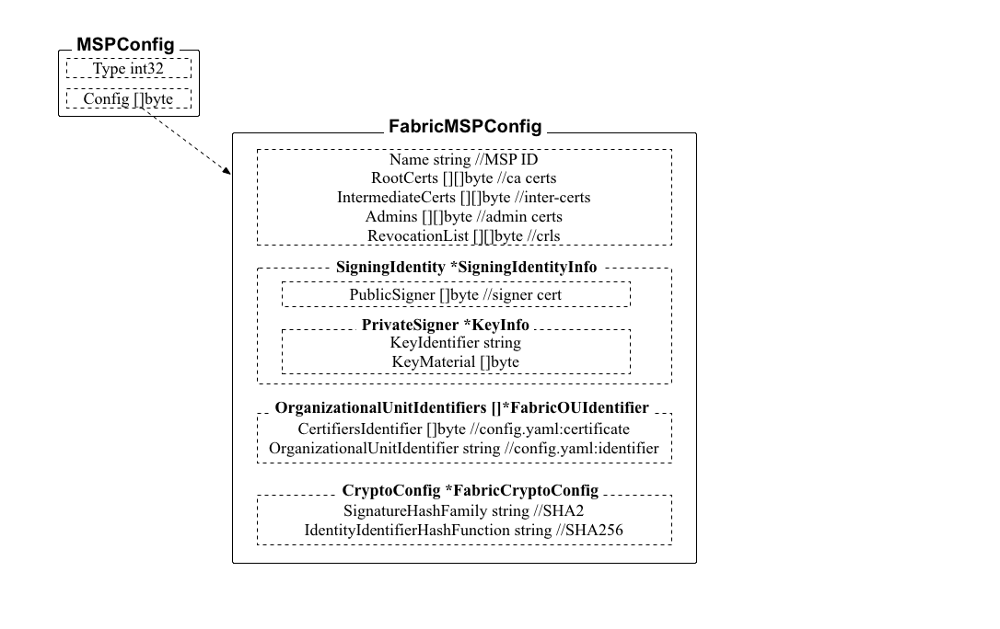

## main.go

主服务，所有 peer 命令都从这里入口。

各个子命令的处理在对应子包中，如

* node：node 对应子命令
* chaincode：chaincode 对应子命令
* channel：channel 对应子命令

main 函数主要完成子命令的注册和一些初始化配置工作，为执行子命令准备好环境，包括：

* mainCmd.AddCommand()注册各个子命令；
* 调用 InitConfig() 从本地的 yaml、环境变量以及命令行选项中读取 Peer 命令相关的配置信息；
* 最后调用 InitCrypto() 从本地读入 MSP 配置文件和 BCCSP 配置，初始化 MSP 部分。初始化会创建本地的一个 bccspmsp 结构（msp.mspimpl.go），然后利用本地读取的 MSP（包括各种证书和私钥等） 和 BCCSP 配置进行初始化。

peer 的 MSP 文件路径从 `peer.mspConfigPath` 变量读取（相对路径，前面会拼接上配置文件路径，默认为 $FABRIC_CFG_PATH/msp）；默认的 mspID 是 `peer.localMspId`（DEFAULT）。BCCSP 配置从 `peer.BCCSP` 中读取。

### MSP 初始化



通过 peer/common/common.go 文件中的 InitCrypto 方法完成。

```go
func InitCrypto(mspMgrConfigDir string, localMSPID string) error {
	// Init the BCCSP
	var bccspConfig *factory.FactoryOpts
	err := viperutil.EnhancedExactUnmarshalKey("peer.BCCSP", &bccspConfig)
	if err != nil {
		return fmt.Errorf("Could not parse YAML config [%s]", err)
	}

	err = mspmgmt.LoadLocalMsp(mspMgrConfigDir, bccspConfig, localMSPID)
	if err != nil {
		return fmt.Errorf("Fatal error when setting up MSP from directory %s: err %s\n", mspMgrConfigDir, err)
	}

	return nil
}
```


其中，默认的 BCCSP 配置从 `peer.BCCSP` 中读取，示例配置为

```yaml
BCCSP:
        Default: SW
        SW:
            # TODO: The default Hash and Security level needs refactoring to be
            # fully configurable. Changing these defaults requires coordination
            # SHA2 is hardcoded in several places, not only BCCSP
            Hash: SHA2
            Security: 256
            # Location of Key Store, can be subdirectory of SbftLocal.DataDir
            FileKeyStore:
                # If "", defaults to 'mspConfigPath'/keystore
                # TODO: Ensure this is read with fabric/core/config.GetPath() once ready
                KeyStore:
```

通过 msp/mgmt/mgmt.go 中的 LoadLocalMsp 方法来导入 MSP 相关的文件和配置。LoadLocalMsp 会先读入各种文件和初始化配置，然后按照配置进行初始化。

首先，调用 msp/cofnigbuilder.go 中的 GetLocalMspConfig 方法，进一步调用 getMspConfig 方法。getMspConfig 方法导入所有提供的 PEM 格式的证书和密钥文件，并从 MSP 配置目录下查找 config.yaml 并读取 OUIdentifier 信息。

之后通过 `GetLocalMSP().Setup(conf)` 进行配置。GetLocalMSP()会通过 msp.NewBccspMsp()生成一个 msp.bccspmsp 对象。之后，调用 msp/mspimpl.go 中的 Setup 方法，将读入的证书文件等配置写到 msp.bccspmsp 对象中。

至此，完成 MSP 的初始化工作。

