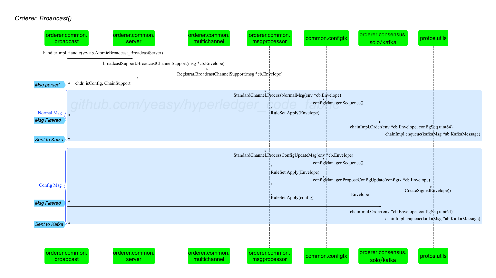

## Orderer 节点 Broadcast 请求的处理

Broadcast，意味着客户端将请求消息（例如完成背书后的交易）通过 gRPC 接口发送给 Ordering 服务。Orderer 进行本地验证处理后，会转化为入队消息发给后端共识模块（如 Kafka）。

发给 Orderer 的 Broadcast 请求消息包括链码的实例化、调用；通道的创建、更新。

来自客户端的请求消息，会首先交给 `orderer.common.server` 包中 server 结构体的 `Broadcast(srv ab.AtomicBroadcast_BroadcastServer) error` 方法处理。该方法主要会调用到 `orderer.common.broadcast` 包中 handlerImpl 结构的 `Handle(srv ab.AtomicBroadcast_BroadcastServer) error` 方法。

handlerImpl 结构体十分重要，在 Orderer 整个处理过程中都会用到。

```go
type handlerImpl struct {
	sm ChannelSupportRegistrar
}

func (bh *handlerImpl) Handle(srv ab.AtomicBroadcast_BroadcastServer) error
```

### 整体过程

Broadcast 请求的整体处理过程如下图所示。



`Handle(srv ab.AtomicBroadcast_BroadcastServer) error` 方法会开启一个循环来从 srv 中读取请求消息并进行处理，直到结束。主要包括解析消息、处理消息（包括配置消息和非配置消息）和返回响应三个步骤。

核心代码如下所示（位于 `orderer/common/broadcast/broadcast.go`）：

```go
for {
	msg, error := srv.Recv() // 从请求中提取一个 Envelope 消息

	// 解析消息：判断是否为配置消息；消息由通道头部中指定的通道 ID 决定哪个账本来处理，本地对应账本结构不存在时（如新建应用通道）则由系统通道来处理
	chdr, isConfig, processor, err := bh.sm.BroadcastChannelSupport(msg) 
	// 检查是否被之前重新提交的消息阻塞
	processor.WaitReady()

	// 对应的通道结构对消息进行处理
	if !isConfig { // 普通消息
		configSeq, err := processor.ProcessNormalMsg(msg) //消息检查
		processor.Order(msg, configSeq) //入队列操作
	} else { // 配置消息，目前只有 CONFIG_UPDATE 类型，如创建、更新通道，或获取配置区块
		config, configSeq, err := processor.ProcessConfigUpdateMsg(msg) // 合并配置更新消息
		processor.Configure(config, configSeq) //入队列操作
	}

	srv.Send(&ab.BroadcastResponse{Status: cb.Status_SUCCESS}) // 返回响应消息
}
```

分为三个步骤：

* 解析消息：判断是否为配置消息，决定消息应由哪个通道结构进行处理，注意对于创建应用通道消息，处理器指定为系统的通道结构；
* 处理消息：选用对应的通道结构对消息进行处理，包括普通消息和配置消息；
* 返回响应消息给请求方。

下面分别进行剖析。

### 解析消息

首先，解析消息，获取消息通道头、是否为配置消息、获取对应处理器结构（链结构）。

```go
chdr, isConfig, processor, err := bh.sm.BroadcastChannelSupport(msg)
```

实际上，会映射到 orderer.common.server 包中 broadcastSupport 结构体的 `BroadcastChannelSupport(msg *cb.Envelope) (*cb.ChannelHeader, bool, broadcast.ChannelSupport, error)` 方法，进一步调用到 orderer.common.multichannel 包中 Registrar 结构体的对应方法。

```go
// orderer/common/multichannel/registrar.go
func (r *Registrar) BroadcastChannelSupport(msg *cb.Envelope) (*cb.ChannelHeader, bool, *ChainSupport, error) {
	chdr, err := utils.ChannelHeader(msg)
	if err != nil {
		return nil, false, nil, fmt.Errorf("could not determine channel ID: %s", err)
	}

	cs, ok := r.chains[chdr.ChannelId] // 应用通道、系统通道
	if !ok {
		cs = r.systemChannel // 空，则默认为系统通道，如查询系统链码（QSCC）的操作
	}

	isConfig := false
	switch cs.ClassifyMsg(chdr) { // 只有 CONFIG_UPDATE 会返回 ConfigUpdateMsg
	case msgprocessor.ConfigUpdateMsg: // CONFIG_UPDATE 消息，包括创建、更新通道，获取配置区块等
		isConfig = true
	default:
	}

	return chdr, isConfig, cs, nil
}
```

channel 头部从消息信封结构中解析出来；是否为配置信息根据消息头中通道类型进行判断（是否为 cb.HeaderType_CONFIG_UPDATE）；通过字典结构查到对应的 ChainSupport 结构（应用通道、系统通道）作为处理器。

之后，利用解析后的结果，分别对不同类型的消息（普通消息、配置消息）进行不同处理。

下面默认以常见的应用通道场景进行介绍。

### 处理普通交易消息

对于普通交易消息，主要执行如下两个操作：消息格式检查和入队列操作。

```go
configSeq, err := processor.ProcessNormalMsg(msg) //消息检查
processor.Order(msg, configSeq) //入队列操作
```

#### 消息格式检查

消息检查方法会映射到 orderer.common.msgprocessor 包中 StandardChannel/SystemChannel 结构体的 `ProcessNormalMsg(env *cb.Envelope) (configSeq uint64, err error)` 方法，以应用通道为例，实现如下。 

```go
// orderer/common/msgprocessor/standardchannel.go
func (s *StandardChannel) ProcessNormalMsg(env *cb.Envelope) (configSeq uint64, err error) {
	configSeq = s.support.Sequence() // 获取配置的序列号，映射到 common.configtx 包中 configManager 结构体的对应方法
	err = s.filters.Apply(env) // 进行过滤检查，实现为 orderer.common.msgprocessor 包中 RuleSet 结构体的对应方法。
	return
}
```

其中，过滤器会在创建 ChainSupport 结构时候初始化：

* 应用通道：orderer.common.mspprocessor 包中的 `CreateStandardChannelFilters(filterSupport channelconfig.Resources) *RuleSet` 方法，包括 EmptyRejectRule、SizeFilter 和 SigFilter（ChannelWriters 角色）。
* 系统通道：orderer.common.mspprocessor 包中的 `CreateSystemChannelFilters(chainCreator ChainCreator, ledgerResources channelconfig.Resources) *RuleSet` 方法，包括 EmptyRejectRule、SizeFilter、SigFilter（ChannelWriters 角色）和 SystemChannelFilter。

#### 入队列操作

入队列操作会根据 consensus 配置的不同映射到 orderer.consensus.solo 包或 orderer.consensus.kafka 包中的方法。

以 kafka 情况为例，会映射到 chainImpl 结构体的对应方法。该方法会将消息进一步封装为 `sarama.ProducerMessage` 类型消息，通过 enqueue 方法发给 Kafka 后端。

```go
// orderer/consensus/kafka/chain.go
func (chain *chainImpl) Order(env *cb.Envelope, configSeq uint64) error {
	marshaledEnv, err := utils.Marshal(env)
	if err != nil {
		return fmt.Errorf("cannot enqueue, unable to marshal envelope because = %s", err)
	}
	if !chain.enqueue(newNormalMessage(marshaledEnv, configSeq)) {
		return fmt.Errorf("cannot enqueue")
	}
	return nil
}
```

### 处理配置交易消息

对于配置交易消息（CONFIG_UPDATE 类型消息，包括创建、更新通道，获取配置区块等），处理过程与正常消息略有不同，包括合并配置更新消息和入队列操作两个操作。

#### 合并配置更新

主要过程包括如下两个步骤：

```go
config, configSeq, err := processor.ProcessConfigUpdateMsg(msg) // 合并配置更新，生成新的配置信封结构
processor.Configure(config, configSeq) //入队列操作，将生成的配置信封结构消息扔给后端队列（如 Kafka）
```

其中，合并配置更新消息方法会映射到 `orderer.common.msgprocessor` 包中 `StandardChannel/SystemChannel` 结构体的 `ProcessConfigUpdateMsg(env *cb.Envelope) (configSeq uint64, err error)` 方法，计算合并后的配置和配置编号。

以应用通道为例，实现如下。 

```go
// orderer/common/msgprocessor/standardchannel.go
func (s *StandardChannel) ProcessConfigUpdateMsg(env *cb.Envelope) (config *cb.Envelope, configSeq uint64, err error) {
	logger.Debugf("Processing config update message for channel %s", s.support.ChainID())

	seq := s.support.Sequence() // 获取当前配置的版本号
	err = s.filters.Apply(env) // 校验权限，是否可以更新配置
	if err != nil {
		return nil, 0, err
	}

	// 根据输入的更新配置交易消息生成配置信封结构：Config 为更新后配置字典；LastUpdate 为输入的更新配置交易
	// 最终调用 `common/configtx` 包下 `ValidatorImpl.ProposeConfigUpdate()` 方法。
	configEnvelope, err := s.support.ProposeConfigUpdate(env)
	if err != nil {
		return nil, 0, err
	}

	// 生成签名的配置信封结构，通道头类型为 HeaderType_CONFIG。即排序后消息类型将由 CONFIG_UPDATE 变更为 CONFIG
	config, err = utils.CreateSignedEnvelope(cb.HeaderType_CONFIG, s.support.ChainID(), s.support.Signer(), configEnvelope, msgVersion, epoch)
	if err != nil {
		return nil, 0, err
	}

	err = s.filters.Apply(config) // 校验生成的配置消息是否合法
	if err != nil {
		return nil, 0, err
	}

	return config, seq, nil
}
```

对于系统通道情况，除了调用普通通道结构的对应方法来处理普通的更新配置交易外，还会负责新建应用通道请求。

```go
// orderer/common/msgprocessor/systemchannel.go
func (s *SystemChannel) ProcessConfigUpdateMsg(envConfigUpdate *cb.Envelope) (config *cb.Envelope, configSeq uint64, err error) {
	channelID, err := utils.ChannelID(envConfigUpdate)
	if channelID == s.support.ChainID() { // 更新配置交易的处理，与普通通道相同
		return s.StandardChannel.ProcessConfigUpdateMsg(envConfigUpdate)
	}

	// 处理新建应用通道请求，封装为 ORDERER_TRANSACTION 类型消息
	bundle, err := s.templator.NewChannelConfig(envConfigUpdate)
	newChannelConfigEnv, err := bundle.ConfigtxValidator().ProposeConfigUpdate(envConfigUpdate)
	newChannelEnvConfig, err := utils.CreateSignedEnvelope(cb.HeaderType_CONFIG, channelID, s.support.Signer(), newChannelConfigEnv, msgVersion, epoch)
	wrappedOrdererTransaction, err := utils.CreateSignedEnvelope(cb.HeaderType_ORDERER_TRANSACTION, s.support.ChainID(), s.support.Signer(), newChannelEnvConfig, msgVersion, epoch)

	s.StandardChannel.filters.Apply(wrappedOrdererTransaction) // 再次校验配置

	// 返回封装后的签名信封结构
	return wrappedOrdererTransaction, s.support.Sequence(), nil
}
```

#### 入队列操作

入队列操作会根据 consensus 配置的不同映射到 `orderer.consensus.solo` 包或 `orderer.consensus.kafka` 包中的方法。

以 kafka 情况为例，会映射到 `chainImpl` 结构体的 `Configure(config *cb.Envelope, configSeq uint64)` 方法。该方法会调用 `configure(config *cb.Envelope, configSeq uint64, originalOffset int64)` 方法，将消息进一步封装为 `KafkaMessage_Regular` 类型消息，通过 enqueue 方法发给 Kafka 后端。

```go
// orderer/consensus/kafka/chain.go
func (chain *chainImpl) configure(config *cb.Envelope, configSeq uint64, originalOffset int64) error {
	marshaledConfig, err := utils.Marshal(config)
	if err != nil {
		return fmt.Errorf("cannot enqueue, unable to marshal config because %s", err)
	}

	// 封装为 `KafkaMessageRegular_CONFIG` 类型消息，并通过 producer 发给 Kafka
	if !chain.enqueue(newConfigMessage(marshaledConfig, configSeq, originalOffset)) {
		return fmt.Errorf("cannot enqueue")
	}
	return nil
}
```

其中，封装为 `KafkaMessageRegular_CONFIG` 类型消息过程十分简单。

```go
// orderer/consensus/kafka/chain.go
func newConfigMessage(config []byte, configSeq uint64, originalOffset int64) *ab.KafkaMessage {
	return &ab.KafkaMessage{
		Type: &ab.KafkaMessage_Regular{
			Regular: &ab.KafkaMessageRegular{
				Payload:        config,
				ConfigSeq:      configSeq,
				Class:          ab.KafkaMessageRegular_CONFIG,
				OriginalOffset: originalOffset,
			},
		},
	}
}
```

之后 Orderer 将再次从 Kakfa 获取到共识（这里主要是排序）完成的 `KafkaMessageRegular_CONFIG` 消息，进行解析和处理。具体可以参考 [Orderer 节点对排序后消息的处理过程](orderer_consume_msg.md)。

### 返回响应

如果处理成功，则返回成功响应消息。

```go
srv.Send(&ab.BroadcastResponse{Status: cb.Status_SUCCESS})
```