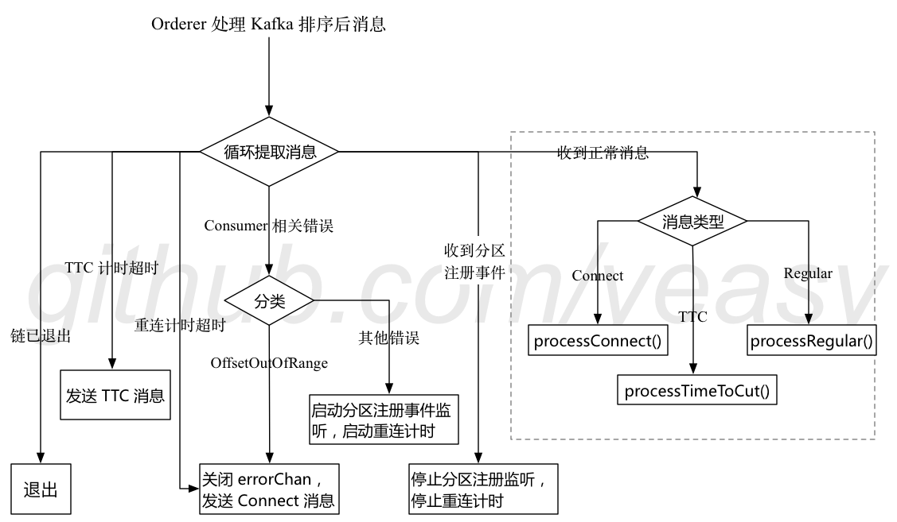

## Orderer 节点对排序后消息的处理

经过 Kafka 排序后的消息，在网络中已经达成了对顺序的共识，后面可以执行提交动作。Orderer 会不断从 Kafka 获取排序后消息，进行提交处理（包括打包为区块，更新本地账本结构等）。

### 主要过程

仍以 Kafka 模式为例，Orderer 节点启动后，会为每个账本结构调用 `orderer/consensus/kafka.chainImpl` 结构体的 `processMessagesToBlocks() ([]uint64, error)` 方法，持续获取 Kafka 对应分区中的消息并进行处理。该方法内是一个 for 循环，不断从对应 Kafka 分区中提取（Consume）消息，满足分块条件（超时或消息的个数或大小满足预设条件）时，还会发送 TimeToCut（TTC） 消息到 Kakfa 对应分区中。

主要逻辑如下图所示。



主要实现代码如下所示。

```go
// orderer/consensus/kafka/chain.go#chainImpl.processMessagesToBlocks()
for {
	select {
		case <-chain.haltChan: // 链故障了，退出
		case kafkaErr := <-chain.channelConsumer.Errors(): //获取 Kakfa 消息发生错误
			select {
				case <-chain.errorChan: // 连接已关闭，不进行任何操作
				default: //其它错误，如 OffsetOutofRange，则关闭 errorChan；否则进行超时重连
			}
			select {
				case <-chain.errorChan: // 连接仍然关闭，尝试后台发送 Connect 消息进行重连
			}
		case <-topicPartitionSubscriptionResumed: // 停止重连计时器，继续提取消息
		case <-deliverSessionTimedOut: // 计时器超时，尝试后台进行重连
		case in, ok := <-chain.channelConsumer.Messages(): // 核心过程：成功读取到正常 Kafka 消息，进行处理
			switch msg.Type.(type) {
			case *ab.KafkaMessage_Connect: // Kafka 连接消息，忽略
			case *ab.KafkaMessage_TimeToCut: // TTC，打包现有的一批消息为区块
			case *ab.KafkaMessage_Regular: // 核心处理：Fabric 相关消息，包括应用通道普通交易、配置更新等
				chain.processRegular(msg.GetRegular(), in.Offset)
		case <-chain.timer: //定期发出 TimeToCut 消息到 Kafka
	}
}
```

其中，除了出错和超时外，最核心过程为处理从 Kakfa 收到的正常消息，主要包括三种类型：

* Connect 消息：Producer 启动后发出，刷新与 Kafka 的连接。目前为忽略该消息。
* Fabric 交易消息（即 Regular 消息）：根据消息内容进行进一步处理，包括普通交易消息和配置消息。
* TimeToCut 消息：收到该消息意味着当前可以进行分块。

对于不同消息，分别调用对应方法进行处理。

### Fabric 交易消息的处理

对于 Fabric 相关消息（包括普通交易消息和配置消息），具体会调用 chainImpl 结构体的 `processRegular(regularMessage *ab.KafkaMessageRegular, receivedOffset int64) error` 方法进行处理。

主要过程如下所示：


该方法的核心代码如下：

```go
// orderer/consensus/kafka/chain.go#chainImpl.processRegular()
func (chain *chainImpl) processRegular(regularMessage *ab.KafkaMessageRegular, receivedOffset int64) error {
	seq := chain.Sequence() // 当前最新的配置版本
	env := &cb.Envelope{}
	proto.Unmarshal(regularMessage.Payload, env) // 从载荷中解析出交易信封结构
	
	// 当前为兼容模式
	if regularMessage.Class == ab.KafkaMessageRegular_UNKNOWN || !chain.SharedConfig().Capabilities().Resubmission() {
		chdr, err := utils.ChannelHeader(env) // 提取通道头
		class := chain.ClassifyMsg(chdr)
		switch class {
			case msgprocessor.ConfigMsg: // 配置消息
				chain.ProcessConfigMsg(env, chain.lastOriginalOffsetProcessed) //检查消息合法性，分应用链和系统链两种情况
				commitConfigMsg(env, chain.lastOriginalOffsetProcessed) // 切块，写入账本。如果是 ORDERER_TRANSACTION 消息，创建新的应用通道账本；如果是 CONFIG 消息，更新配置。
			case msgprocessor.NormalMsg: // 普通消息
				chain.ProcessNormalMsg(env) // 检查消息合法性，分应用链和系统链两种情况
				commitNormalMsg(env, chain.lastOriginalOffsetProcessed) // 处理交易消息，满足条件则切块，并写入本地账本
			case msgprocessor.ConfigUpdateMsg: // 配置更新消息，报错
		}
		return nil
	}
	
	// 非兼容模式
	switch regularMessage.Class {
		case ab.KafkaMessageRegular_NORMAL: // 普通交易消息
			// 如果是二次提交的消息，并且之前已经被处理过，则直接返回
			if regularMessage.OriginalOffset != 0 {
				if regularMessage.OriginalOffset <= chain.lastOriginalOffsetProcessed {
					return nil
				}
			}
			
			if regularMessage.ConfigSeq < seq { // 消息带的配置版本过旧
				chain.ProcessNormalMsg(env) // 检查消息合法性，分应用链和系统链两种情况
				chain.order(env, configSeq, receivedOffset) // 用新的配置版本和新的 offset，重新提交消息进行排序
				return nil
			}
			offset := regularMessage.OriginalOffset
			if offset == 0 {
				offset = chain.lastOriginalOffsetProcessed
			}
			commitNormalMsg(env, offset) // 处理交易消息，满足条件则切块，并写入本地账本

		case ab.KafkaMessageRegular_CONFIG: // 配置消息，包括通道头部类型为 CONFIG、CONFIG_UPDATE、ORDERER_TRANSACTION 三种
			// 如果是二次提交的消息
			if regularMessage.OriginalOffset != 0 {
				if regularMessage.OriginalOffset <= chain.lastOriginalOffsetProcessed { // 之前已经被处理过，则直接返回
					return nil
				}
				if regularMessage.OriginalOffset == chain.lastResubmittedConfigOffset && regularMessage.ConfigSeq == seq {
					// 刚重新提交的消息，无需再次提交，解除对接收消息的阻塞
					close(chain.doneReprocessingMsgInFlight)
				}
				// 更新最新二次提交消息的偏移量
				if chain.lastResubmittedConfigOffset < regularMessage.OriginalOffset {
					chain.lastResubmittedConfigOffset = regularMessage.OriginalOffset
				}
			}

			if regularMessage.ConfigSeq < seq { // 消息带的配置版本过旧
				chain.ProcessConfigMsg(env) //检查消息合法性，分应用链和系统链两种情况
				chain.configure(configEnv, configSeq, receivedOffset) // 用新的配置版本和新的 offset，重新提交消息进行排序
				chain.lastResubmittedConfigOffset = receivedOffset //更新最新的偏移量
				chain.doneReprocessingMsgInFlight = make(chan struct{}) // 阻塞消息接收，等待当前二次提交消息的处理完成
				return nil
			}

			commitConfigMsg(env, chain.lastOriginalOffsetProcessed) // 切块，写入账本。如果是 ORDERER_TRANSACTION 消息，创建新的应用通道账本；如果是 CONFIG 消息，更新配置。
	}
}
```

#### 普通交易消息

普通交易消息，会检查是否满足生成区块的条件，满足则产生区块并写入本地账本结构。通过内部的 `commitNormalMsg(env)` 方法来完成。

该方法主要调用 `orderer/common/multichannel` 模块中 `BlockWriter` 结构体的 `CreateNextBlock(messages []*cb.Envelope) *cb.Block` 方法和 `WriteBlock(block *cb.Block, encodedMetadataValue []byte)` 方法。

`CreateNextBlock(messages []*cb.Envelope) *cb.Block` 方法基本过程十分简单，创建新的区块，将传入的交易的信封结构直接序列化到 `block.Data.Data[]` 域中。

```go
// orderer/common/multichannel/blockwriter.go
func (bw *BlockWriter) CreateNextBlock(messages []*cb.Envelope) *cb.Block {
	previousBlockHash := bw.lastBlock.Header.Hash()

	data := &cb.BlockData{
		Data: make([][]byte, len(messages)),
	}

	var err error
	for i, msg := range messages {
		data.Data[i], err = proto.Marshal(msg)
		if err != nil {
			logger.Panicf("Could not marshal envelope: %s", err)
		}
	}

	block := cb.NewBlock(bw.lastBlock.Header.Number+1, previousBlockHash)
	block.Header.DataHash = data.Hash()
	block.Data = data

	return block
}
```
`WriteBlock(block *cb.Block, encodedMetadataValue []byte)` 方法则将 Kafka 相关的元数据也附加到区块结构中，添加区块的签名、最新配置的签名，并写入到本地账本。

```go
// orderer/common/multichannel/blockwriter.go
func (bw *BlockWriter) WriteBlock(block *cb.Block, encodedMetadataValue []byte) {
	bw.committingBlock.Lock()
	bw.lastBlock = block

	go func() {
		defer bw.committingBlock.Unlock()
		bw.commitBlock(encodedMetadataValue)
	}()
}
```

Kafka 相关的元数据（KafkaMetadata）包括：

* LastOffsetPersisted：上次消息的偏移量；
* LastOriginalOffsetProcessed：本条消息被重复处理时，最新的偏移量；
* LastResubmittedConfigOffset：上次提交的配置消息的偏移量。

#### 配置交易消息

首先会检查消息中配置版本号是否跟当前链上的配置版本号一致。

如果不一致，则会更新后生成新的配置信封消息，扔回到后端的共识模块（如 Kafka），并且阻塞新的 Broadcast 消息直到重新提交的消息得到处理。代码片段如下：

```go
// orderer/consensus/kafka/chain.go
if regularMessage.ConfigSeq < seq { // 消息中配置版本并非最新版本
	configEnv, configSeq, err := chain.ProcessConfigMsg(env)

	// For both messages that are ordered for the first time or re-ordered, we set original offset
	// to current received offset and re-order it.
	if err := chain.configure(configEnv, configSeq, receivedOffset); err != nil {
		return fmt.Errorf("error re-submitting config message because = %s", err)
	}

	chain.lastResubmittedConfigOffset = receivedOffset      // Keep track of last resubmitted message offset
	chain.doneReprocessingMsgInFlight = make(chan struct{}) // Create the channel to block ingress messages

	return nil
}
```

如果版本一致，则调用内部的 `commitConfigMsg(env)` 方法根据信封结构来产生区块，代码如下：

```go
// orderer/consensus/kafka/chain.go
commitConfigMsg := func(message *cb.Envelope, newOffset int64) {
    batch := chain.BlockCutter().Cut() // 尝试把收到的交易汇总

    if batch != nil { // 如果已经积累了一些交易，则先把它们打包为区块
        block := chain.CreateNextBlock(batch)
        metadata := utils.MarshalOrPanic(&ab.KafkaMetadata{
            LastOffsetPersisted:         receivedOffset - 1,
            LastOriginalOffsetProcessed: chain.lastOriginalOffsetProcessed,
            LastResubmittedConfigOffset: chain.lastResubmittedConfigOffset,
        })
        chain.WriteBlock(block, metadata)
        chain.lastCutBlockNumber++
    }

    chain.lastOriginalOffsetProcessed = newOffset
    block := chain.CreateNextBlock([]*cb.Envelope{message}) // 将配置交易生成区块
    metadata := utils.MarshalOrPanic(&ab.KafkaMetadata{
        LastOffsetPersisted:         receivedOffset,
        LastOriginalOffsetProcessed: chain.lastOriginalOffsetProcessed,
        LastResubmittedConfigOffset: chain.lastResubmittedConfigOffset,
    })
    chain.WriteConfigBlock(block, metadata) // 添加区块到系统链
    chain.lastCutBlockNumber++
    chain.timer = nil
}
```

由于每个配置消息都需要单独生成区块。因此，如果之前已经收到了一些普通交易消息，会先把这些消息生成区块。

接下来，调用 `orderer/common/multichannel` 模块中 `BlockWriter` 结构体的 `CreateNextBlock(messages []*cb.Envelope) *cb.Block` 方法和 `WriteConfigBlock(block *cb.Block, encodedMetadataValue []byte)` 方法来分别打包区块和更新账本结构。

其中，`WriteConfigBlock()` 方法执行解析消息和处理的主要逻辑（包括创建新的应用通道和更新已有通道的配置两种），核心代码如下所示。

```go
// orderer/common/multichannel/blockwriter.go
func (bw *BlockWriter) WriteConfigBlock(block *cb.Block, encodedMetadataValue []byte) {

	// 解析配置交易信封结构，每个区块中只有一个配置交易
	ctx, err := utils.ExtractEnvelope(block, 0)

	// 解析载荷和通道头结构
	payload, err := utils.UnmarshalPayload(ctx.Payload)
	chdr, err := utils.UnmarshalChannelHeader(payload.Header.ChannelHeader)

	// 按照配置交易内容，执行对应操作
	switch chdr.Type { // 排序后只有 ORDERER_TRANSACTION 和 CONFIG 两种类型消息
		case int32(cb.HeaderType_ORDERER_TRANSACTION): // 新建应用通道
			// 尝试解析配置更新消息，不成功则 panic
			newChannelConfig, err := utils.UnmarshalEnvelope(payload.Data)
			// 创建新的本地账本结构并启动对应的轮询消息过程，实际调用 orderer/common/multichannel.Registrar.newChain(configtx *cb.Envelope)
			bw.registrar.newChain(newChannelConfig)
		case int32(cb.HeaderType_CONFIG): // 更新通道配置
			configEnvelope, err := configtx.UnmarshalConfigEnvelope(payload.Data)
			// 检查配置信息是否合法，实际调用 common/configtx/validator.ValidatorImpl.Validate(configEnv *cb.ConfigEnvelope) error 方法
			err = bw.support.Validate(configEnvelope)
			// 写区块时配置不应该还有问题，有错误则 panic
			if err != nil {
			logger.Panicf("Told to write a config block with new config, but could not apply it: %s", err)
			}
			// 更新配置
			bundle, err := bw.support.CreateBundle(chdr.ChannelId, configEnvelope.Config)
			bw.support.Update(bundle)

	}

	// 将区块写入到本地账本结构
	bw.WriteBlock(block, encodedMetadataValue)
}	
```

##### 创建新的应用通道
创建新的本地账本结构并启动对应的轮询消息过程，实际调用 `orderer/common/multichannel.Registrar.newChain(configtx *cb.Envelope)` 方法。


##### 更新已有通道配置

首先，检查配置信息是否合法，实际调用 `common/configtx/validator.ValidatorImpl.Validate(configEnv *cb.ConfigEnvelope) error` 方法，主要核对：

* 版本号需要比现在的递增 1；
* 发起人拥有对应更新的权限；
* 配置更新交易结构正确。

