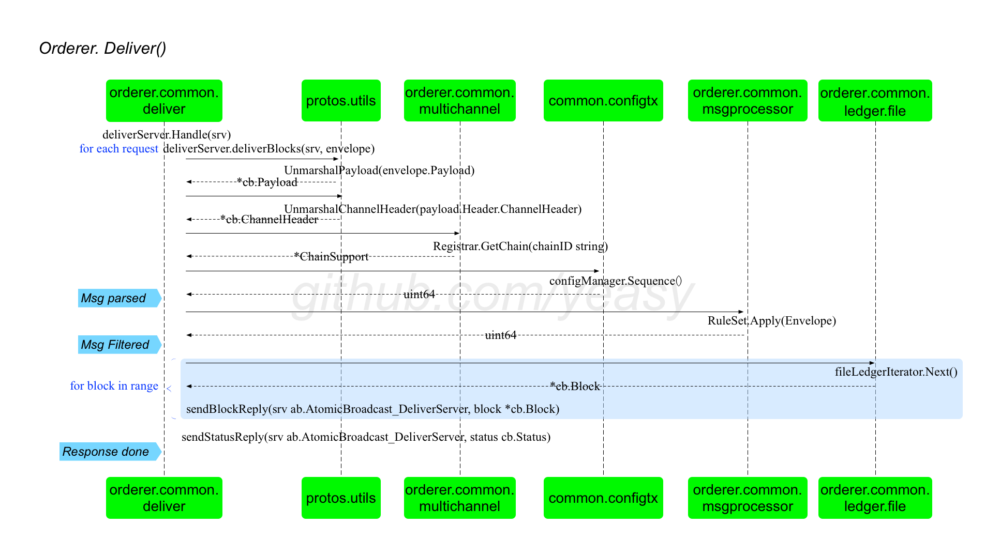

## Orderer 节点 Deliver 请求的处理

Deliver，意味着客户端通过 gRPC 接口从 Ordering 服务获取数据（例如指定区块的数据）。

Orderer 节点收到请求消息，会首先交给 `orderer.common.server` 包中 server 结构体的 `Deliver(srv ab.AtomicBroadcast_DeliverServer) error` 方法处理。该方法进一步调用 `orderer.common.deliver` 包中 deliverServer 结构的 `Handle(srv ab.AtomicBroadcast_DeliverServer) error` 方法进行处理。

deliverServer 结构体十分重要，完成对 Deliver 请求的处理过程。

```go
type deliverServer struct {
	sm SupportManager
}

func (ds *deliverServer) Handle(srv ab.AtomicBroadcast_DeliverServer) error
```

### 整体过程

整体处理过程如下图所示。



`Handle(srv ab.AtomicBroadcast_DeliverServer) error` 方法会开启一个循环来从 srv 中不断读取请求消息并进行处理，直到结束。

核心代码如下所示，包括提取消息和对消息进行处理两个步骤。

```go
for {
	envelope, err := srv.Recv() // 从请求中提取一个 Envelope 消息
	ds.deliverBlocks(srv, envelope) // 对消息进行处理并答复，核心过程
}
```

可见，对单个请求的处理都在 `deliverBlocks(srv ab.AtomicBroadcast_DeliverServer, envelope *cb.Envelope)` 方法中。该方法的处理过程包括解析消息、检查合法性、发送区块以及返回响应四个步骤。

下面具体对其进行具体分析。

### 解析消息

首先，从请求的 Envelope 结构中提取载荷（Payload），进一步从载荷中提取通道头部信息。利用通道头部信息获取对应的本地链结构，并获取当前最新的配置序列号。

```go
// 提取载荷
payload, err := utils.UnmarshalPayload(envelope.Payload)

// 提取通道头
chdr, err := utils.UnmarshalChannelHeader(payload.Header.ChannelHeader)

// 获取链结构，映射到 orderer.common.multichannel 包中 Registrar 结构体中对应方法
chain, ok := ds.sm.GetChain(chdr.ChannelId)

// 获取当前配置序列号
lastConfigSequence := chain.Sequence()
```

### 检查合法性

包括对权限和 seekInfo 数据进行检查。

首先，检查请求方是否对通道拥有读权限。

```go
sf := msgprocessor.NewSigFilter(policies.ChannelReaders, chain.PolicyManager())
if err := sf.Apply(envelope); err != nil {
	logger.Warningf("[channel: %s] Received unauthorized deliver request from %s: %s", chdr.ChannelId, addr, err)
	return sendStatusReply(srv, cb.Status_FORBIDDEN)
}
```

接下来，从 Envelope 结构的 payload.data 域中解析出 seekInfo 结构，并检查其合法性。

```go
proto.Unmarshal(payload.Data, seekInfo)
chain.Reader().Iterator(seekInfo.Start)

// 检查 seekInfo 的
cursor, number := chain.Reader().Iterator(seekInfo.Start)
switch stop := seekInfo.Stop.Type.(type) {
case *ab.SeekPosition_Oldest: // 截止到最早的区块
	stopNum = number
case *ab.SeekPosition_Newest: // 截止到最新的区块
	stopNum = chain.Reader().Height() - 1
case *ab.SeekPosition_Specified: // 截止到特定的区块
	stopNum = stop.Specified.Number
	if stopNum < number {
		logger.Warningf("[channel: %s] Received invalid seekInfo message from %s: start number %d greater than stop number %d", chdr.ChannelId, addr, number, stopNum)
		return sendStatusReply(srv, cb.Status_BAD_REQUEST)
	}
}
```

### 发送区块

在指定的起始和截止范围内，逐个从本地账本读取区块，并发送对应的区块数据，

核心代码如下所示。

```go
for {
	block, status := cursor.Next() // 获取区块
	sendBlockReply(srv, block) // 发送区块
	if stopNum == block.Header.Number {
		break
	}
}
```


### 返回响应

如果处理成功，则返回成功响应消息。

```go
sendStatusReply(srv, cb.Status_SUCCESS)
```
